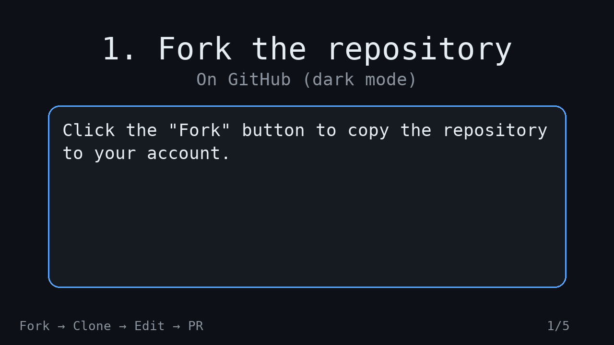

# 🚀 Proyecto1

Este repositorio es un ejemplo de proyecto en equipo.

---

## 📑 Índice

1. ⭐ Badges
2. 🤝 Cómo contribuir
3. 🛠️ Realiza tus cambios
4. 🔄 Sincroniza tu fork con el repositorio original
5. 📤 Crea un pull request
6. 📝 Describe tu pull request
7. 🎥 Flujo de contribución (GIF)
8. 🧠 Espera la revisión

---

## ⭐ Badges

---

## 🤝 Cómo contribuir

### 🔱 Haz un fork del repositorio 

- Ve a la página principal del repositorio y haz clic en el botón **"Fork"** en la esquina superior derecha.  
  Esto creará una copia de este repositorio en tu cuenta de GitHub.

### 📥 Clona el repositorio forked

**En GitHub:**  
- Ve a tu perfil de GitHub y encuentra el repositorio forked (con tu nombre de usuario).  
  Haz clic en él para abrirlo.

**En tu ordenador personal:**

git clone https://github.com/TuUsuario/Proyecto1.git
cd Proyecto1

---

## 🛠️ **Realiza tus cambios**

**En GitHub**
- Navega a los archivos que deseas modificar.
- Realiza los cambios necesarios y luego baja a la parte inferior de la página para confirmarlos, escribiendo un mensaje descriptivo y presionando el botón **"Commit changes"**.

**En tu ordenador personal**
- Edita los archivos con tu editor favorito (VSCode).

**Verifica los cambios con:**
git status
git diff

**Agrega los archivos modificados:**

 git add nombre-del-archivo   # Para un archivo específico
 git add .                    # Para todos los cambios

**Haz un commit descriptivo:**

 git commit -m "Descripción clara de los cambios"

## 🔄 **Sincroniza tu fork con el repositorio original**

**En GitHub**

**Para mantener tu fork actualizado con los cambios más recientes del repositorio original:**

- Ve a la página principal de tu repositorio forked.
- Haz clic en "Sync fork" para sincronizar tu fork con el repositorio original.

**En tu ordenador personal**

**Configura el repositorio original como upstream:**

 git remote add upstream https://github.com/bienvenidoconquerx/proyecto1.git
 git remote -v

**Antes de subir tus cambios, sincroniza tu rama desde upstream:**

 git fetch upstream

## 📤 **Crea un pull request**

**En GitHub**

**Si tus cambios están listos, ve a la página principal de tu repositorio forked y haz clic en:**
 "Contribute" → "Open pull request"

**En tu ordenador personal**

 git push -u origin main

## ✅ **Tus cambios en local ya se han subido a GitHub.**

**Ahora podemos hacer la pull request en GitHub haciendo clic en:**

 "Contribute" → "Open pull request"

## 📝 **Describe tu pull request**

**En GitHub**

- Proporciona una descripción detallada de los cambios que has realizado.
- Incluye cualquier información relevante que pueda ayudar a entender mejor tus contribuciones.
- Haz clic en "Create pull request" para enviar.

## **🎥 Flujo de contribución (GIF)**

 

## 🧠 **Espera la revisión**

**En GitHub**

- Uno de los mantenedores del proyecto revisará tu pull request y te enviará una respuesta.

